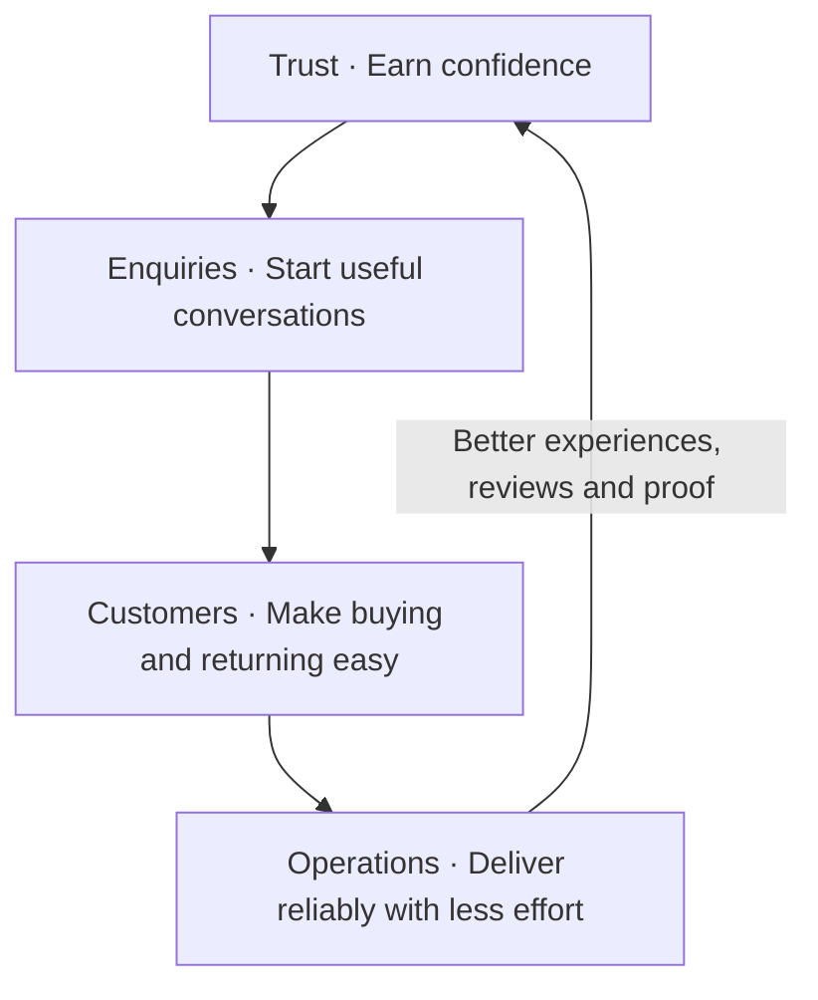

# Sorted Value Model

Version 1.0 · 5 October 2026 · Core business doctrine

## The value proposition

**Sorted makes your business easier to trust, easier to contact, easier to buy from, and easier to run.**

We improve the digital systems behind those four outcomes, starting with a website you can see before you decide.

**Trust. Enquiries. Customers. Operations.**

The website opens the relationship. The four pillars guide how we improve the business.

## The model in one picture



This is a reinforcing loop, not a guarantee that one stage automatically produces the next. Demand, offer quality, pricing and delivery still matter. Operations support every stage, even before a business has customers.

The four pillars describe **customer value**. Sorted's existing Four Engines describe **how Sorted produces and distributes that value**. Both models retain their own purpose.

## The pocket version

Ask four questions:

1. **Trust:** Why should I choose you?
2. **Enquiries:** How easily can I get useful help?
3. **Customers:** How easily can I buy and keep getting value?
4. **Operations:** Can you deliver without unnecessary effort or things falling apart?

Remember three checks per pillar:

| Trust | Enquiries | Customers | Operations |
| --- | --- | --- | --- |
| Reputation | Ease | Actions | Data |
| Brand | Responsiveness | Engagement | Context |
| Proof | Helpfulness | Resources | Flow |

**Four questions. Twelve checks. One costly gap to fix next.**

## 1. Trust

**Make the business's real quality easy to recognise and believe.**

| Check | Dimension | Simple assessment question |
| --- | --- | --- |
| Reputation | Reviews | Do credible, relevant customer reviews support the business's claims? |
| Reputation | Narrative | Does the wider internet present a credible, consistent picture of the business? |
| Brand | Image | Does the business look competent, consistent and appropriate for its customers? |
| Brand | Purpose | Is it obvious who the business helps, what it does and why that matters? |
| Proof | Evidence | Is there documented work, expertise or outcomes that support its claims? |
| Proof | Breadth | Is there enough relevant proof across its main offers and customer situations? |

**Boundary:** Reputation is what others say. Brand is how the business presents itself. Proof is what can be demonstrated. A review containing a documented result can support both, but do not count the same benefit twice in an impact estimate.

Breadth refines “volume”: ten relevant examples can be more useful than a hundred repetitive ones. Purpose needs a clear reason to choose the business, not a grand mission statement. Narrative includes search results, listings, coverage and public discussion; silence is not evidence of a bad reputation.

## 2. Enquiries

**Make it easy to begin a conversation and get useful help.**

| Check | Dimension | Simple assessment question |
| --- | --- | --- |
| Ease | Friction | Can someone contact the business with few steps and little effort? |
| Ease | Access | Can they find and use an appropriate contact route on their device and at a useful time? |
| Responsiveness | Speed | Does the person receive a useful response within a sensible time for the need? |
| Responsiveness | Follow-through | Are enquiries followed up, owned and brought to a clear next step? |
| Helpfulness | Resolution | Does the response actually answer the question or solve the immediate problem? |
| Helpfulness | Guidance | Does the person understand the best next step and what to expect? |

**Boundary:** Ease covers reaching the business. Responsiveness covers receiving attention. Helpfulness covers the usefulness of that attention. An instant acknowledgement is not the same as an answer.

Access and guidance fill the two missing dimensions. Follow-through refines “follow-ups”: completing the conversation matters more than sending more messages.

## 3. Customers

**Make buying straightforward and the relationship worth continuing.**

| Check | Dimension | Simple assessment question |
| --- | --- | --- |
| Actions | Transactions | Can someone reliably book, pay, purchase or accept an offer through a suitable route? |
| Actions | Clarity | Are the offer, terms and required next action understandable? |
| Engagement | Cadence | Does the business engage at useful moments before, during and after purchase? |
| Engagement | Relevance | Does that engagement match the customer's situation and needs? |
| Resources | Tools | Are there useful services, resources or tools that help customers accomplish something? |
| Resources | Insights | Does the business share knowledge that helps customers make decisions or save time and money? |

**Boundary:** Enquiries handle an open question. Customers cover commitment, purchase and continuing value. Engagement is communication; resources are useful things customers can use or learn from.

Cadence refines “frequency”: timely, relevant contact beats constant contact. Tools can include calculators, checklists, guides, customer portals and paid or free offers. Score usefulness, not feature count. A quote-led business can have an excellent transaction pathway without an ecommerce checkout.

## 4. Operations

**Make delivery visible, connected and reliable as demand grows.**

| Check | Dimension | Simple assessment question |
| --- | --- | --- |
| Data | Tracking | Are the important activities and outcomes recorded accurately enough to measure performance? |
| Data | Decisions | Is that information used to identify problems and choose useful improvements? |
| Context | Documentation | Is essential information current and organised around a trusted source of truth? |
| Context | Access | Can the right people find the information they need when they need it? |
| Flow | Handoffs | Does work move between people and systems with clear ownership and next steps? |
| Flow | Resilience | Can the process handle realistic increases in demand and recover from failures? |

**Boundary:** Data explains performance. Context preserves what people need to know. Flow moves work to completion.

Decisions refines “analytics”: collecting charts creates little value unless someone uses them. Resilience refines “scale”: test likely growth, exceptions and recovery rather than hypothetical unlimited scale. A source of truth can connect several systems; everything need not live in one application.

## The scoring heuristic

### Quick assessment: twelve checks

Give each check a score based on its two dimensions:

| Score | Meaning | Evidence standard |
| --- | --- | --- |
| 0 | Missing or broken | A relevant capability is demonstrably absent or fails. |
| 1 | Present but weak | It exists, but there is clear friction, inconsistency or limited usefulness. |
| 2 | Clear and reliable | Both dimensions work well enough for the business's actual needs. |
| ? | Unknown | There is not enough evidence to judge. |
| N/A | Not applicable | The capability has no meaningful role in this business; record why. |

When one dimension is strong and the other is weak, use 1. When a dimension is unknown, keep the check unknown unless the observed dimension already demonstrates a failure; label any resulting score partial and state what remains unverified.

Each complete pillar scores **0–6**. The complete model scores **0–24**.

Keep the four pillar scores visible. A high total can conceal a broken contact or payment pathway. The model is a diagnostic heuristic, not a validated prediction of revenue or a measure of overall business quality.

### Assessment discipline

- Record a source or observation for every score, with the assessment date.
- Separate public observations from owner-confirmed information and tested behaviour.
- Never turn unknown into zero. Missing public evidence does not prove missing internal capability.
- Public outreach assessments usually cover Trust and some of Ease, Actions and Resources. Response handling, customer engagement and internal operations generally require access or a conversation.
- For incomplete assessments, report known points against the applicable assessed maximum, plus the number of unknown checks. Example: **Trust 4/6; Enquiries not yet assessed**. Do not imply an incomplete score is directly comparable with a complete one.
- Avoid cross-business rankings until the same evidence standards and business context are applied consistently.
- Score fit for the business, not sophistication. A simple, reliable process can earn 2.

### Choose the next intervention

**Fix the most consequential confirmed gap that Sorted can credibly improve.**

Use three questions: Is it costing something meaningful? Can we fix it? Can we show whether the fix worked?

Priority is not automatically the lowest score. A broken booking link may deserve attention before a weak image library. An unknown process is a discovery question, not an upsell opportunity.

## How the model guides Sorted

### Outreach

Lead with one visible gap and tangible proof of a better experience. Translate the gap into a customer consequence. Do not send a prospect a speculative diagnosis of their entire business.

Example: “Your reviews give people a strong reason to choose you. On mobile, the quote route is hard to find. I’ve put together a clearer version that brings your proof and the next step together.”

Structure: **Observed substance → observed gap → useful improvement → invitation.**

A mockup demonstrates an intended experience. A working build demonstrates functionality. Neither proves increased enquiries or revenue until measured.

### Objection handling

| Objection | Bring the conversation back to value |
| --- | --- |
| “We already have a website.” | Identify whether it makes the business easy to trust, contact and buy from. If those work well, look elsewhere or leave it alone. |
| “We get enough enquiries.” | Explore whether handling and delivery create avoidable work. More enquiries may not be the right goal. |
| “We rely on referrals.” | Ask how referred customers verify the business and take the next step. Support what already works. |
| “We just need a better design.” | Link each proposed design change to recognition, understanding or action. |
| “We need more sales.” | Check demand, the offer and where the journey loses people. Agree what Sorted can affect and measure. |
| “We can do it ourselves.” | Compare the time, ownership and maintenance required with the value of having it done. |
| “Why keep paying monthly?” | Identify ongoing work and measurable continuing value. Recommend recurring support only when that need exists. |

### Service evolution

| Pillar | Possible interventions | Evidence of improvement |
| --- | --- | --- |
| Trust | Brand clarity, real work galleries, case studies, review collection and presentation | Better customer understanding; more relevant credible proof; measured changes in choosing/contacting behaviour |
| Enquiries | Contact journeys, routing, acknowledgement, useful follow-up and booking | Contact completion, useful response time, unresolved enquiries, qualified bookings |
| Customers | Offer clarity, booking/payment flows, relevant nurture and useful resources | Transaction completion, enquiry-to-customer conversion, repeat purchases and resource usefulness |
| Operations | Scorecards, connected records, documentation, handoffs and automation | Time spent, errors, missed handoffs, completion time and reliability under realistic demand |

These are options, not a bundled promise. Each engagement needs a specific problem, scope, baseline, owner and success measure. Record denominators and time periods for conversion rates; distinguish observed change from change demonstrably caused by Sorted.

**Recurring revenue comes from recurring responsibility and value:** maintenance, monitoring, improving content and proof, tuning follow-up, keeping information current and reviewing performance. The score alone does not justify a subscription.

## Repository integration

Canonical destination: `doctrine/sorted-value-model.md`.

The supplied agent brief's Section 7.5 has been updated to reference this four-pillar model, replacing its older three-stage framework. Put the updated brief at the repository's existing `AGENTS.md` location and place this file at the destination above in the same change.

For downstream operator updates:

1. Website analyser: organise observed opportunities under the four pillars; retain evidence and unknowns.
2. Outreach drafter: choose one confirmed gap and connect demonstrated work to its customer consequence.
3. Proposal and delivery: state the pillar, intervention, scope and agreed success measure.
4. Service review: revisit evidence and choose the next useful improvement.

Read current operator files before editing their implementation. This document does not claim those updates have already been made.

Agent rule: **Every significant recommendation must name the value it creates, the gap it addresses and how improvement will be observed.** Supporting infrastructure may enable that value indirectly; explain the connection.

## Reusable assessment record

```markdown
Business:
Date / assessor:
Evidence available:

Trust: Reputation __ / Brand __ / Proof __
Enquiries: Ease __ / Responsiveness __ / Helpfulness __
Customers: Actions __ / Engagement __ / Resources __
Operations: Data __ / Context __ / Flow __

Evidence and reasoning per check:
Unknowns / N/A reasons:
Strongest existing substance:
Most consequential confirmed gap:
Customer or owner consequence:
Recommended intervention and scope:
Baseline / success measure / review date:
Owner:
```

## The operating principle

**Earn confidence. Make contact easy. Help customers act. Deliver reliably. Turn the result into stronger trust.**

Find one costly gap. Improve something real. Prove the result. Earn the next conversation.
